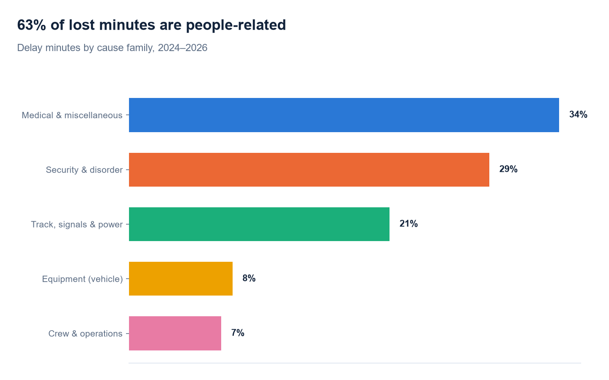
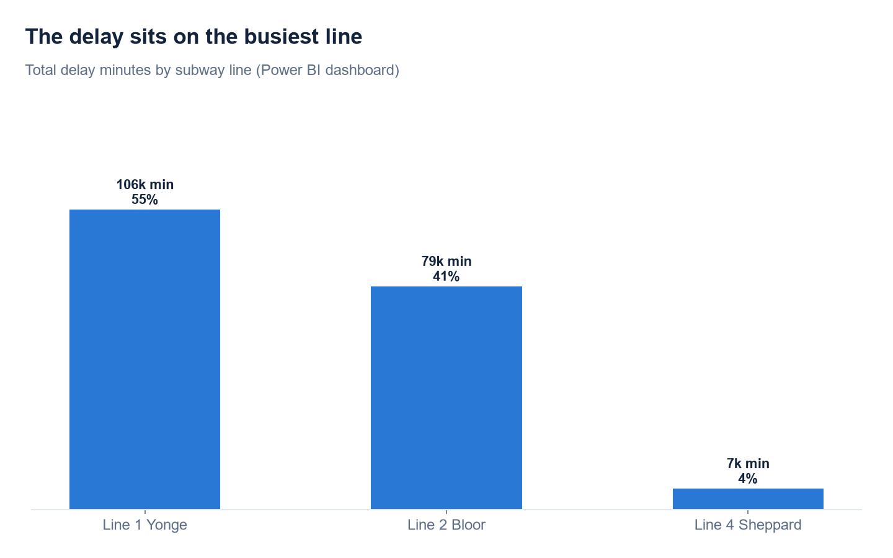
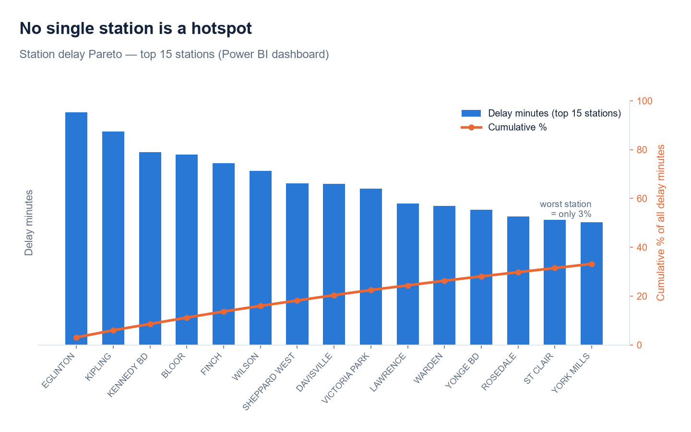

# TTC Transit Reliability: where Toronto's subway loses its minutes

> Sector: Public transit / operations. Data: City of Toronto Open Data (real). Tools: Power Query, SQL (SQLite), Power BI, Datawrapper. Method: delay decomposition and concentration.

All data is real, from the City of Toronto Open Data Portal under the Open Government Licence. Written in my own voice.

## Visuals

## The problem
I took every subway delay Toronto logged over 2024, 2025, and 2026 to date and worked out where the lost time actually comes from. The TTC records each delay with a cause, a station, and the minutes lost, but it treats delay as one big number, so it cannot say which causes, lines, or times to target. I wanted to break that number apart and end with a short list of where the agency should act.

## The scale
Over the period there were about 24,500 delays adding up to 192,000 minutes, roughly 3,200 hours of lost service.

## What I found
The first thing surprised me. The subway is not mostly delayed by breaking down. Equipment faults are only 8% of the lost minutes. Almost two-thirds, 63%, are people-related: medical events, disorder, assaults, and passenger alarms. Track, signals and power add another 21%, and those incidents are the longest, averaging over nine minutes each.

The delay sits on the busiest line. Line 1 carries 55% of the lost minutes and Line 2 another 41%, so a minute recovered on Line 1 reaches the most riders.

Then two things I expected to find, and did not. I looked for a few bad stations and there are none. The worst station is 3% of the total, and it takes about twenty stations to reach 40%. The delay is spread across the whole network, and the stations at the top are mostly termini and yards where trains turn around, not the downtown interchanges. I also looked for a rush-hour pattern and it is not there. The lost minutes are close to flat from early morning to midnight, with bumps in the afternoon and at start-of-service around 5 to 6am, when overnight work surfaces as trains start up.

## What it means
Put together, this is a systemic problem, not a local one. You cannot fix a station or a time window, because the delay is not in any one of them. It is in the cause. Most of the lost time comes from what happens with people on the system, spread evenly across the network and concentrated only on Line 1.

## The decision
The lever is response, not repair.

- Put incident-response capacity, meaning station staff, transit safety, and medical response, where the minutes are. That is Line 1, and because the problem is systemic, across the network rather than at a few hubs.
- Treat the track and signal failures separately. They are rarer but the longest, so each fix buys back the most time per incident.
- Do not chase individual stations or rush-hour staffing alone. The data does not support either as the main fix.

## How I built it
I stacked the yearly files and cleaned them in Power Query, joined the delay-code lookup and rolled the 140 codes into five cause families, built the analysis in SQLite one query per question, and built the dashboard in Power BI so a planner can filter delay by line, cause, and time and read the heat map by hour and day.

## Limitations
The cause is whatever the TTC assigned to each delay, which can be coarse. Delay minutes are schedule delay, not total rider-minutes lost, so a delay in rush hour affects far more people than the same delay at midnight. This is subway only; bus and streetcar are separate files. And 2026 is a partial year, so I read where, why, and when rather than the year-to-year trend.
